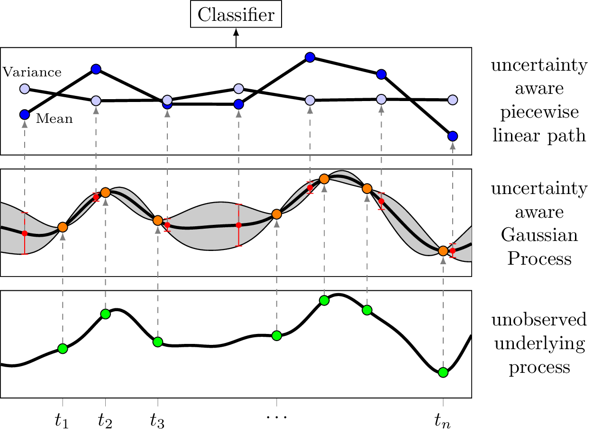
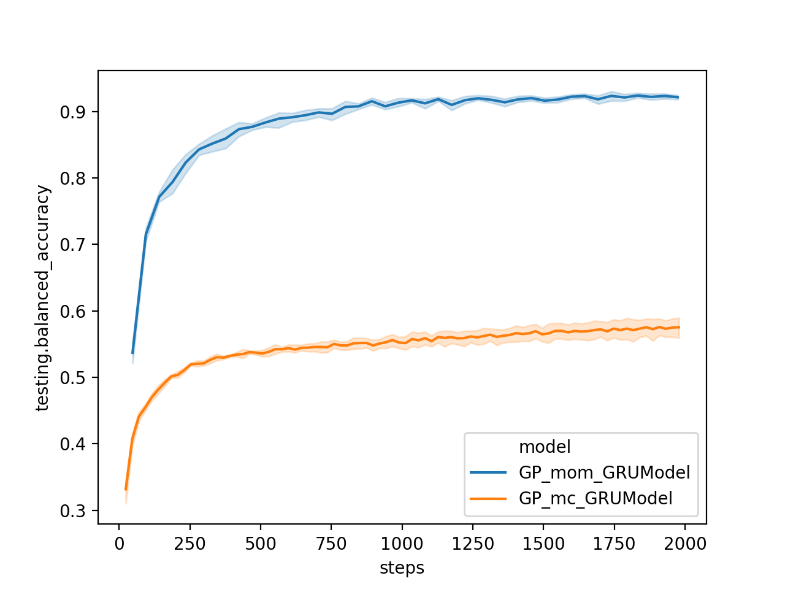

# GP-PoM: Gaussian Process Adapters with Posterior Moments 

<p align="center">

</p>
 
## Reference  
This repository contains code for GP-PoM method as presented in the following [paper](https://arxiv.org/abs/2005.12359):
```
@misc{moor2020path,
  title          ={Path Imputation Strategies for Signature Models of Irregular Time Series},
  author        = {Moor, Michael and Horn, Max and Bock, Christian and Borgwardt, Karsten and Rieck, Bastian},
  eprint        = {2005.12359},
  archiveprefix = {arXiv},
  primaryclass  = {cs.LG},
  year          = {2020},
}

```   
Furthermore, this work was subsumed in this [short paper](https://openreview.net/forum?id=P0DL7M6T57o) which was accepted for presentation at the ICML 2020 workshop on the art of learning with missing values (Artemiss).

## Environment
Please install the dependencies as indicated in the `requirements.txt` or `pyproject.toml` file:  
```console
$ poetry install
$ poetry shell
```


## GP-PoM: GP Adapter with posterior moments
If you are interesting in the raw torch modules which implement GPyTorch-based multi-task GP adapters (our novel GP-PoM as well as the standard monte carlo GP adapter), please check out `src/models`. 
  
In order to quickly test these models on a real-world dataset, simply run:  
```console
python exp/train_model.py with model.GPRNNModel dataset.PenDigits model.parameters.sampling_type=moments
```
 
In case no GPU is available, simply add the argument `device=cpu`.  

The above python command starts a fit of a GP adapter using posterior moments (GP-PoM), by default using a GRU cell on the PenDigits dataset. To run a conventional GP adapter employing monte carlo sampling, simply replace mode.parameters.sampling_type=monte_carlo (or leave away the argument, since this is the default).   

To make the above example experiment possible, we have provided some boilerplate experiment code under `exp/` which makes it easy for us to quickly run a GP-PoM method on a irregularly spaced (due to subsampling) dataset, namely PenDigits.
Keep in mind that several library dependencies are only due to this application and are not essential to the GP-PoM implementation (for instance `sacred`).  
 
## Comparing GP-PoM Adapter against standard monte carlo GP adapter:

Here, we compare the training of a GP-PoM GRU Model against the standard monte carlo GP GRU baseline on the PenDigits dataset after randomly discarding 30% of all time series observations (but fixed for both methods). Using the best hyperparameters for each method, as identified in the [paper](https://arxiv.org/abs/2005.12359), we fit 5 repetitions and plot the test performance over the first 2000 mini batch steps in terms of balanced accuracy.   

<p align="center">

</p>
 

## Contributors   
Michael Moor ([github](https://github.com/mi92))  
Bastian Rieck ([github](https://github.com/pseudomanifold))   
Max Horn ([github](https://github.com/expectationmax))   
Christian Bock ([github](https://github.com/chrisby))    
Patrick Kidger ([github](https://github.com/patrick-kidger))  
